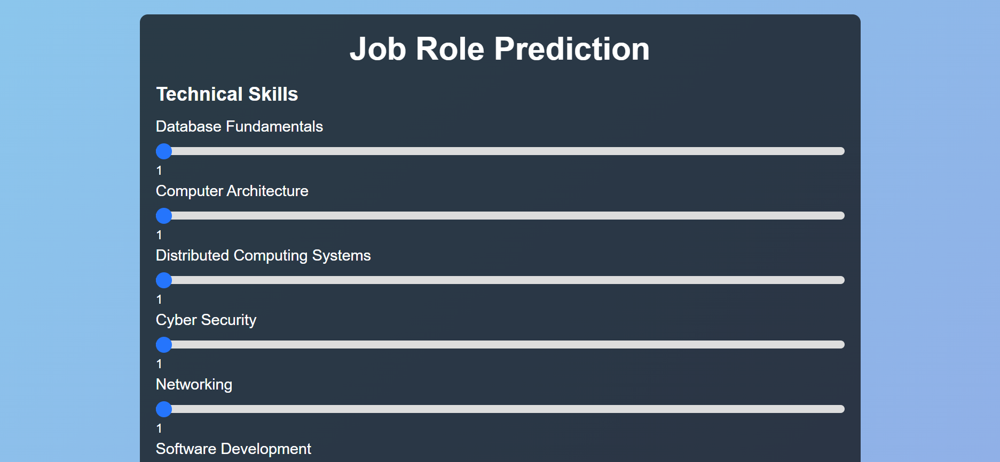
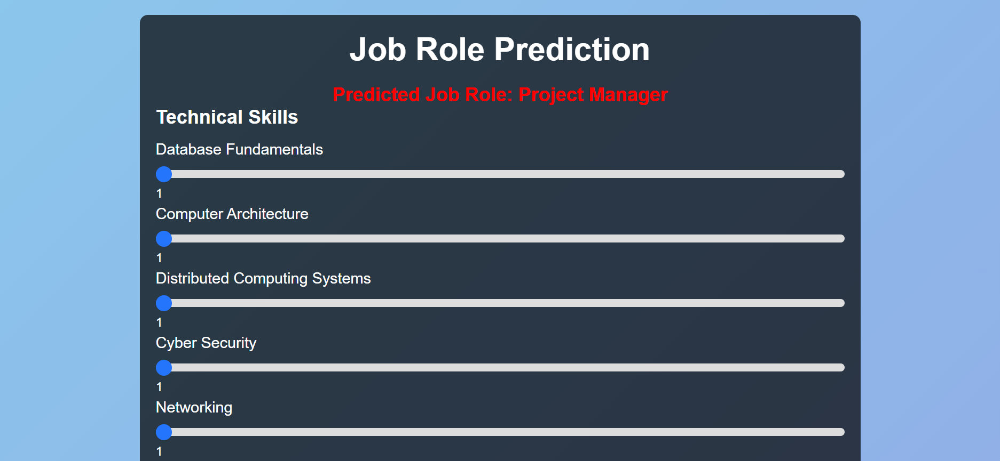

# AI Job Title Predictor 

## 🎯 Objective
Leverage a Random Forest model to give students personalized career guidance by predicting job roles from a blend of technical and non-technical skills.

## ❓ Why This Matters
- Students struggle to match their unique skills & interests with the right career paths.  
- Traditional counseling is either scarce, expensive, or too generic—missing emerging roles.

## 💡 Problem Statement
> In today’s dynamic job market, aligning an individual’s profile with ideal career opportunities is challenging. We bridge this gap with ML-driven predictions that reduce manual effort, limit bias, and streamline guidance.

## 📊 Survey & Research Highlights
- **Naive Bayes**: 95.63% accuracy but limited scalability.  
- **Facebook Graph API**: 77.4% (aptitude), 75.4% (personality), 60.1% (background).  
- **Case-Based Reasoning vs. Decision Tree J-48**: 80% vs. 65%.  
- **BERT (multilingual)**: 62.2% F-score (dev), 47.4% F-score (test).  
- **Random Forest**: Up to 99% in similar preference-based studies.  
- **AdaBoost**: ~62%.

## 🦾 Features
- **Skill-rating UI**: Sliders for 25+ skills & personality traits  
- **Real-time prediction**: RF model served via Flask  
- **Dynamic display**: Shows predicted job title instantly  
- **Live deployment**: Free on Render (may take ~1 min to wake up)

## 📸 Screenshots

### 🔹 Input Form Page


### 🔹 Prediction Result Displayed


> **Live Demo:** https://aijobtitlepredictor.onrender.com *(may take a minute to open)*


## Run Locally

Clone the project

```bash
  git clone https://github.com/SudarshanKomar/job_title_prediction.git
```

Go to the project directory

```bash
  cd job_title_prediction
```

Install dependencies

```bash
  pip install -r requirements.txt
```

Start the server

```bash
  python app.py
```

## API Reference

#### Get Home Page

GET /

Returns the homepage HTML with the skills input form.

---

#### Predict Job Title

POST /

Submits form data to predict a job title based on skill ratings.

| Parameter                          | Type   | Description         |
| :-------------------------------- | :----- | :------------------ |
| Database_Fundamentals             | float  | Rating from 0–10    |
| Computer_Architecture             | float  | Rating from 0–10    |
| Distributed_Computing_Systems     | float  | Rating from 0–10    |
| Cyber_Security                    | float  | Rating from 0–10    |
| Networking                        | float  | Rating from 0–10    |
| Software_Development              | float  | Rating from 0–10    |
| Programming_Skills                | float  | Rating from 0–10    |
| Project_Management                | float  | Rating from 0–10    |
| Computer_Forensics_Fundamentals  | float  | Rating from 0–10    |
| Technical_Communication           | float  | Rating from 0–10    |
| AI_ML                             | float  | Rating from 0–10    |
| Software_Engineering              | float  | Rating from 0–10    |
| Business_Analysis                 | float  | Rating from 0–10    |
| Communication_skills              | float  | Rating from 0–10    |
| Data_Science                      | float  | Rating from 0–10    |
| Troubleshooting_skills            | float  | Rating from 0–10    |
| Graphics_Designing                | float  | Rating from 0–10    |
| Openness                          | float  | Rating from 0–10    |
| Conscientousness                  | float  | Rating from 0–10    |
| Extraversion                      | float  | Rating from 0–10    |
| Agreeableness                     | float  | Rating from 0–10    |
| Emotional_Range                   | float  | Rating from 0–10    |
| Conversation                      | float  | Rating from 0–10    |
| Openness_to_Change                | float  | Rating from 0–10    |
| Hedonism                          | float  | Rating from 0–10    |
| Self-enhancement                  | float  | Rating from 0–10    |
| Self-transcendence                | float  | Rating from 0–10    |

---

#### predict_role(input_data)

Takes the user’s skill ratings and returns a suitable job title prediction.

## Acknowledgements

- Thanks to open-source ML libraries: **scikit-learn**, **Flask**

- Icon set by **Heroicons**
